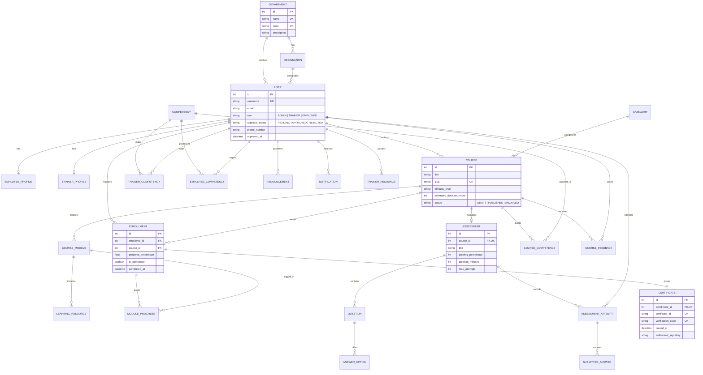

# Capacity Connect — Entity-Relationship Diagram (ERD)
## SIH 2026 | Problem Statement ID: SIH26075
### Ministry of Earth Sciences (MoES) / Central Organizations

```mermaid
erDiagram
    DEPARTMENT ||--o{ DESIGNATION : has
    DEPARTMENT ||--o{ USER : employs
    DESIGNATION ||--o{ USER : designates
    USER ||--o| EMPLOYEE_PROFILE : has
    USER ||--o| TRAINER_PROFILE : has
    
    USER ||--o{ COURSE : authors
    CATEGORY ||--o{ COURSE : categorizes
    COURSE ||--o{ COURSE_MODULE : contains
    COURSE_MODULE ||--o{ LEARNING_RESOURCE : includes
    
    USER ||--o{ ENROLLMENT : registers
    COURSE ||--o{ ENROLLMENT : enrols
    ENROLLMENT ||--o{ MODULE_PROGRESS : tracks
    COURSE_MODULE ||--o{ MODULE_PROGRESS : logged_in
    
    COURSE ||--o| ASSESSMENT : evaluates
    ASSESSMENT ||--o{ QUESTION : contains
    QUESTION ||--o{ ANSWER_OPTION : offers
    ASSESSMENT ||--o{ ASSESSMENT_ATTEMPT : records
    USER ||--o{ ASSESSMENT_ATTEMPT : attempts
    ASSESSMENT_ATTEMPT ||--o{ SUBMITTED_ANSWER : answers
    
    COMPETENCY ||--o{ TRAINER_COMPETENCY : maps
    USER ||--o{ TRAINER_COMPETENCY : possesses
    COMPETENCY ||--o{ EMPLOYEE_COMPETENCY : maps
    USER ||--o{ EMPLOYEE_COMPETENCY : targets
    COURSE ||--o{ COURSE_COMPETENCY : builds
    COMPETENCY ||--o{ COURSE_COMPETENCY : outcome_of
    
    ENROLLMENT ||--o| CERTIFICATE : issues
    
    USER ||--o{ ANNOUNCEMENT : publishes
    USER ||--o{ NOTIFICATION : receives
    COURSE ||--o{ COURSE_FEEDBACK : receives
    USER ||--o{ COURSE_FEEDBACK : writes
    USER ||--o{ TRAINER_RESOURCE : uploads

    USER {
        int id PK
        string username UK
        string email
        string role "ADMIN | TRAINER | EMPLOYEE"
        string approval_status "PENDING | APPROVED | REJECTED"
        string phone_number
        datetime approved_at
    }

    DEPARTMENT {
        int id PK
        string name UK
        string code UK
        string description
    }

    COURSE {
        int id PK
        string title
        string slug UK
        string difficulty_level
        int estimated_duration_hours
        string status "DRAFT | PUBLISHED | ARCHIVED"
    }

    ENROLLMENT {
        int id PK
        int employee_id FK
        int course_id FK
        float progress_percentage
        boolean is_completed
        datetime completed_at
    }

    ASSESSMENT {
        int id PK
        int course_id FK, UK
        string title
        int passing_percentage
        int duration_minutes
        int max_attempts
    }

    CERTIFICATE {
        int id PK
        int enrollment_id FK, UK
        string certificate_id UK
        string verification_code UK
        datetime issued_at
        string authorized_signatory
    }
```

